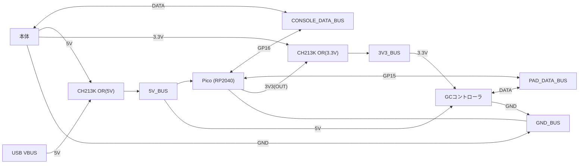

# ハードウェア構成（現行ブレッドボード配線）

このプロジェクトは Raspberry Pi Pico(RP2040) を「本体 ↔ GCコントローラ」の間に挟み、
Joybus(DATA)を中継・加工する構成。

## ネット（バス）名
- `GND_BUS`
- `5V_BUS`（給電系5Vの合流点）
- `3V3_BUS`（給電系3.3Vの合流点）
- `CONSOLE_DATA_BUS`（本体側DATAのバス）
- `PAD_DATA_BUS`（コントローラ側DATAのバス）

## 全体図（概念）

※DATA線はそれぞれシリーズ抵抗あり（後述）。
※実際の電源入力先（PicoのVSYS/VBUS等）は配線に合わせて更新する。

## 本体（コンソール）から来る線
本体側ハーネス: `5V, 3.3V, DATA, GND, GND`

### 5V（本体 → 5V_BUS）
- 本体5V → 10kΩ → GND_BUS（ブリーダ/放電・浮き対策）
- 本体5V → CH213K → 5V_BUS
- 5V_BUS → 10uF X7S MLCC → GND_BUS（デカップリング）

### 3.3V（本体 → 3V3_BUS）
- 本体3.3V → 10kΩ(1/4W) → GND_BUS（ブリーダ/放電・浮き対策）
- 本体3.3V → CH213K → 3V3_BUS
- 3V3_BUS → 10uF X7S MLCC → GND_BUS（デカップリング）

### GND
- 本体GND(2本) → GND_BUS

### DATA（本体DATA → CONSOLE_DATA_BUS）
- 本体DATA → CONSOLE_DATA_BUS
- CONSOLE_DATA_BUS ↔ 100Ω(1/4W) シリーズ抵抗 ↔ Pico GP16

## Picoから出る/入る線
### 電源
- Pico VBUS → CH213K → 5V_BUS
- Pico 3V3(OUT) → CH213K → 3V3_BUS

### DATA
- Pico GP16 ↔ 100Ω(1/4W) シリーズ抵抗 ↔ CONSOLE_DATA_BUS
- Pico GP15 ↔ 100Ω(1/4W) シリーズ抵抗 ↔ PAD_DATA_BUS

### PAD側DATAのプルアップ
- Pico 3V3(OUT) → 1kΩ(1/4W) → PAD_DATA_BUS

メモ：PAD_DATA_BUS は Pico から明示プルアップしている。CONSOLE_DATA_BUS は現状、明示プルアップ無し（本体側の挙動に依存）。

### デバッグプローブ接続
- Pico GP0, GP1, GND → Debug Probe 「U」コネクタ
- Pico SWCLK, SWDIO, GND → Debug Probe 「D」コネクタ

## コントローラから来る線
コントローラ側ハーネス: `5V, 3.3V, DATA, GND, GND`
- 5V_BUS → コントローラ 5V
- 3V3_BUS → コントローラ 3.3V
- コントローラ DATA → PAD_DATA_BUS
- コントローラ GND(2本) → GND_BUS

## その他（BOOTSEL用ボタン）
- Pico GP26 ↔（タクトスイッチ）↔ GND(28番ピン / GND_BUS)
- 目的：USB抜き差し無しで BOOTSEL モードに入る

## 設計意図（要点）
- CH213Kで 本体電源とUSB電源のORを作り、逆流を避けつつ両方接続を許容する
- 10uF MLCCは各バスの瞬間的な電流変動（抜き差し/負荷変動）の緩和
- DATA線の100Ωは立ち上がり抑制・保護（リンギング/過渡）目的
